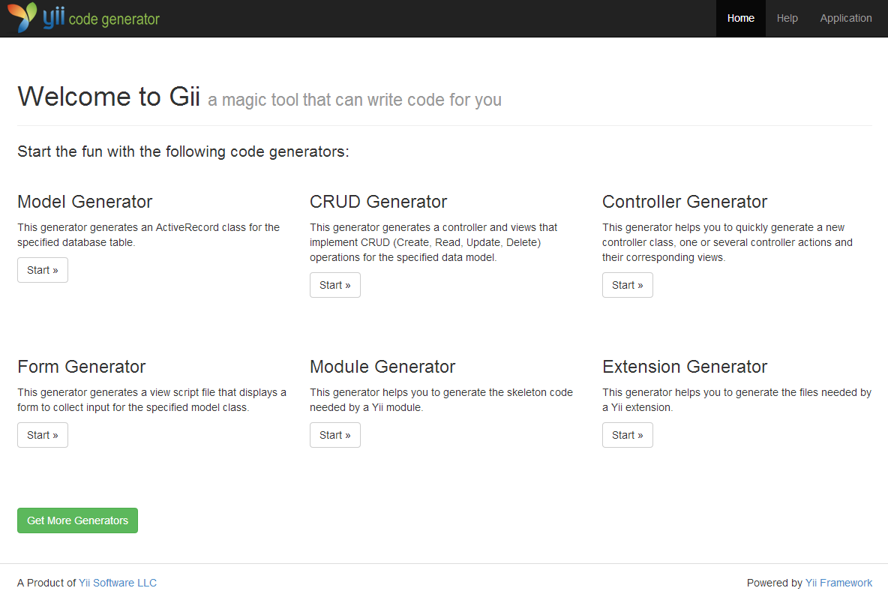

基本的な使用方法
================

Gii にアクセスすると、最初に、ジェネレータを選択できるエントリページが開かれます。

デフォルトでは、以下のジェネレータを利用できます。

- **モデルジェネレータ** - このジェネレータは、指定したデータベーステーブルの ActiveRecord クラスを生成します。
- **CRUD ジェネレータ** - このジェネレータは、指定されたデータモデルの CRUD 操作 (作成・読み出し・更新・削除) を実装するコントローラとビューを生成します。
- **コントローラジェネレータ** - このジェネレータは、新しいコントローラのクラスと、一つまたはいくつかのコントローラアクションおよびそれに対応するビューを迅速に生成するのを手助けしてくれます。
- **フォームジェネレータ** - このジェネレータは、指定されたモデルクラスのための、入力を収集するフォームを表示するビュースクリプトを生成します。
- **モジュールジェネレータ** - このジェネレータは、Yii のモジュールが必要とするコードのスケルトンを生成するのを手助けしてくれます。
- **エクステンションジェネレータ** - このジェネレータは、Yii のエクステンションが必要とするファイルの生成を手助けしてくれます。

"Start" ボタンをクリックしてジェネレータを選択すると、ジェネレータのパラメータを構成するためのフォームが表示されます。
あなたの要求を満たすようにフォームに入力して "Preview" ボタンをクリックすると、Gii が生成しようとしているコードのプレビューが出来ます。
選択したジェネレータや、既存のファイルの有無によって多少異なりますが、次の画像で見るのと同じような出力が得られます。

ファイル名をクリックすると、そのファイルのために生成されるコードのプレビューを見ることが出来ます。
ファイルが既に存在する場合は、既存のコードと生成されるコードのどこが異なるかを示す差分ビューも提供されます。
その場合は、どのファイルを上書きし、どのファイルを上書きしないかを選択することも出来ます。

> Tip|ヒント: データベースに変更を加えた後で、モデルジェネレータを使ってモデルを更新したい場合は、Gii のプレビューからコードをコピーして、あなたのコードに変更をマージすることが出来ます。
PHPStorm の [クリップボードと比較](http://www.jetbrains.com/phpstorm/webhelp/comparing-files.html) のような IDE の機能を使うと良いでしょう。
[Aptana Studio](http://www.aptana.com/products/studio3/download) や [Eclipse](http://www.eclipse.org/pdt/) ベースのエディタも [AnyEdit tools plugin](http://andrei.gmxhome.de/anyedit/) を使って [クリップボードと比較](http://andrei.gmxhome.de/anyedit/examples.html) をすることが出来ます。
この機能を使うと、関係のある変更だけを取り込んで、あなた自身のコードを取り消すような他の変更は放っておくことが出来ます。

コードをレビューして、生成すべきファイルを選択し、"Generate" ボタンをクリックするとファイルが生成されます。
すべてうまく行けば、これで終りです。
Gii がファイルを生成できないというエラーが出た場合は、ウェブサーバがファイルを作成してディレクトリに書き込むことが出来るように、ディレクトリのアクセス権限を修正しなければなりません。

> Note|注意: Gii によって生成されるコードは、あなたの要求に従って修正すべきテンプレートに過ぎません。
  Gii は新しいものを素早く作成する手助けをするために存在するものですが、そのまま使用できるコードを作成するようなものではありません。
  Gii によって生成されたモデルを変更せずに、ちょっとした所だけを修正して使っている人をよく見かけます。
  これは、意図されている Gii の使い方ではありません。
  Gii によって生成されるコードは不完全であったり、間違っていたりする可能性があるもので、あなたの要求を満たすように変更して初めて使用できるようになるものです。

